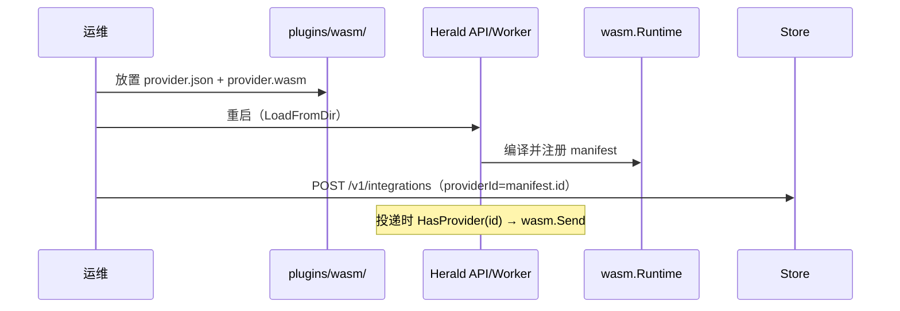

# WASM Provider 扩展指南

Herald 的 channel provider **全部以 WASM 扩展交付**。新增 provider **不需要修改 Herald 核心代码**，只需添加插件目录并配置 Integration。

## 1. 是否需要改核心代码？

| 操作 | 改核心？ |
|------|----------|
| 新增 email/sms/push/chat provider | **否** — 仅新增 WASM 插件目录 |
| 修改 provider 发送逻辑 | **否** — 重编译 `provider.wasm` 并重启 |
| 新增渠道类型（如 `webhook`） | **可能** — 需在 `internal/domain/channel.go` 增加 `ChannelType` |
| 修改 WASM ABI（导出函数） | **是** — 需改 `internal/platform/plugin/wasm/runtime.go` |

## 2. 插件目录结构

在 `WASM_PLUGIN_DIR`（默认 `./plugins/wasm`）下每个 provider 一个子目录：

```
plugins/wasm/
  sendgrid/
    provider.json    # manifest（id 全局唯一）
    provider.wasm    # 编译产物
  twilio-sms/
    provider.json
    provider.wasm
```

### provider.json 示例

```json
{
  "id": "sendgrid",
  "channel": "email",
  "version": "1.0.0",
  "permissions": ["network:https://api.sendgrid.com"],
  "configSchema": {
    "apiKey": "secret",
    "from": "string"
  }
}
```

- `id`：与 Integration 的 `providerId` 一致
- `channel`：`email` | `sms` | `push` | `chat`（`in_app` 由核心处理，无需 WASM）

## 3. WASM ABI

导出函数（见 `pkg/plugin/wasm/abi.go`）：

| 函数 | 说明 |
|------|------|
| `malloc(size uint32) uint32` | 分配 WASM 内存 |
| `Send(inPtr, inLen uint32) (outPtr, outLen uint32)` | 发送；输入/输出均为 JSON |
| `ValidateConfig(inPtr, inLen uint32) (outPtr, outLen uint32)` | 校验 credentials（可选）；输出 `{"ok":true}` 或 `{"ok":false,"error":"..."}` |

**Send 输入 JSON：**

```json
{
  "config": { "apiKey": "...", "from": "..." },
  "request": {
    "to": { "email": "user@example.com" },
    "subject": "...",
    "body": "...",
    "htmlBody": "..."
  },
  "context": {
    "envId": "...",
    "subscriberPk": "...",
    "workflowId": "...",
    "notificationId": "...",
    "transactionId": "...",
    "payload": { }
  }
}
```

`context` 由核心注入；插件也可在运行时调用 host `get_context` 读取同一份数据。

### Host imports（模块名 `herald`）

| 函数 | 说明 |
|------|------|
| `log(level, ptr, len)` | 写宿主 slog（level: 0=debug … 3=error） |
| `get_context(outPtr, outCap) -> written` | 写入 CallContext JSON |
| `http_fetch(reqPtr, reqLen, outPtr, outCap) -> written` | 出站 HTTP；需 manifest `permissions` 含 `network:https://...` |

TinyGo SDK：`plugins/sdk/herald/host.go`

**http_fetch 请求 JSON：**

```json
{ "method": "POST", "url": "https://api.sendgrid.com/v3/mail/send", "headers": {}, "body": {} }
```

**http_fetch 响应 JSON：**

```json
{ "statusCode": 202, "body": "..." }
```

**Send 输出 JSON：**

```json
{ "providerRef": "msg-123", "retryable": false }
```

### 编译示例（TinyGo / wasip1）

```bash
cd plugins/wasm/my-provider
GOOS=wasip1 GOARCH=wasm tinygo build -o provider.wasm .
```

参考实现：`plugins/wasm/example-webhook/`

## 4. 运行时流程



1. **启动加载**：API 与 Worker 均在 bootstrap 时 `LoadFromDir()`，两边都必须能访问同一 `WASM_PLUGIN_DIR`
2. **创建 Integration**：`POST /v1/integrations`，`providerId` 与 manifest `id` 一致；创建时会调用 WASM `ValidateConfig`（若导出）

## 5. API 操作示例

```bash
# 查看已加载 WASM manifest
curl -H "Authorization: ApiKey $KEY" http://localhost:8080/v1/providers

# 创建 Integration（无需改 Go 代码）
curl -X POST http://localhost:8080/v1/integrations \
  -H "Authorization: ApiKey $KEY" \
  -H "Content-Type: application/json" \
  -d '{
    "channel": "email",
    "providerId": "sendgrid",
    "name": "SendGrid Prod",
    "credentials": { "apiKey": "SG.xxx", "from": "noreply@example.com" },
    "primary": true,
    "active": true
  }'
```

## 6. 开发检查清单

- [ ] `provider.json` 的 `id` 唯一且与 Integration 一致
- [ ] `channel` 与 workflow 步骤类型匹配
- [ ] `provider.wasm` 导出 `malloc` + `Send`
- [ ] API **与 Worker** 均能读到插件目录（共享卷或相同路径）
- [ ] 重启后 `GET /v1/providers` 列表包含新 provider（`runtime: wasm`）

## 8. 已知限制（与 ARCHITECTURE 同步）

| ID | 说明 |
|----|------|
| P1-6 | 每次 Send 重新 InstantiateModule |

完整清单：[ARCHITECTURE.md §7.3](ARCHITECTURE.md#73-已知限制与待办)

## 9. 参考

- [ARCHITECTURE.md](ARCHITECTURE.md) — 整体架构与待办
- [pkg/plugin/wasm/abi.go](../pkg/plugin/wasm/abi.go) — ABI 常量与类型
- [plugins/wasm/example-webhook/](../plugins/wasm/example-webhook/) — 示例
